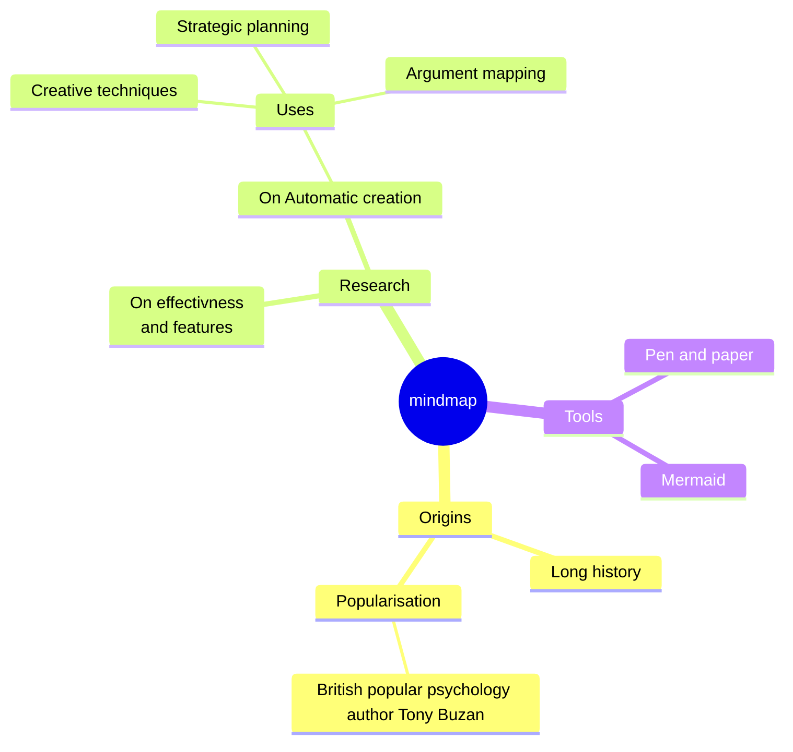

<!--  -->

## Roborescue Software Leader

- 🔭 I’m currently studying at the University of Malaga
- 🌱 I’m currently learning Robotics Engineering 
- 👯 I’m collaborating on Robotic projects in Roborescue
- 📫 How to reach me: miguelian@uma.es

### Working with:

### My Stats

  
 

<!--

-->

